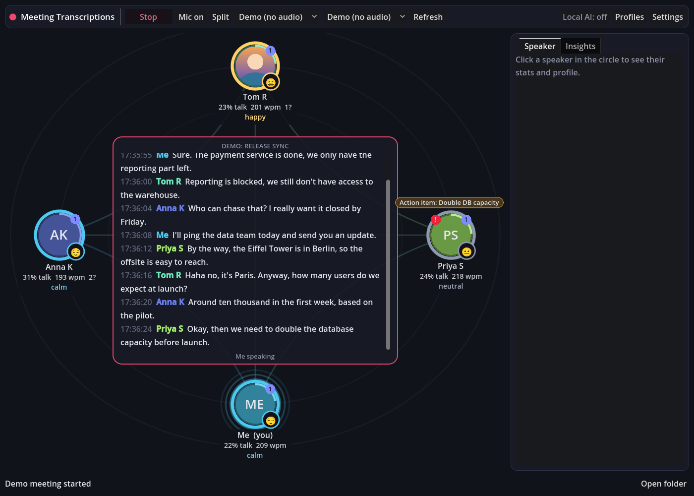

# Meeting Transcriptions

Near real-time transcription of both sides of a call: your microphone and whatever comes out of your speakers (the people on the other side of Teams/Zoom/Meet). Everyone who talks shows up as a node in a circle, the live transcript runs in the middle, and the app builds a profile with stats for each speaker over time.

Optionally, local AI ([Laya](https://pypi.org/project/laya/) by default, or Ollama) runs live checks on every line: mood of each speaker, a fact check, and any custom checks you write yourself. Nothing of that leaves your machine.



## Install

No Godot or Python needed, the release is a normal app with everything inside.

**Windows** (PowerShell):

```powershell
irm https://raw.githubusercontent.com/karlis-balcers/meeting-transcriptions/main/install.ps1 | iex
```

Installs to `%LOCALAPPDATA%\Programs\MeetingTranscriptions` and adds Start menu and Desktop shortcuts. Run it again to update.

**macOS** (Apple Silicon):

```sh
curl -fsSL https://raw.githubusercontent.com/karlis-balcers/meeting-transcriptions/main/install.sh | bash
```

Installs `MeetingTranscriptions.app` to `/Applications` (or `~/Applications`). The app isn't notarized, so the script removes the download quarantine flag for you. For the other side of the call you need BlackHole, see below. Intel Macs: run from source for now.

Or grab the zip yourself from the [Releases](https://github.com/karlis-balcers/meeting-transcriptions/releases) page. Then open **Settings**, paste your OpenAI API key and press **Start**.

## How it's built

- **UI: Godot 4.4 (GDScript)** in `ui/`. A 2D scene with the speaker circle, transcript, a speaker sidebar with stats and mood over time, an insights feed, settings and saved profiles.
- **Engine: Python 3.11+** in `engine/`. Audio capture, transcription and speaker detection are restored from the last Python version (commit `c1d41bc`, before the Go rewrite), because that's the part that worked well. On top of it the engine adds per-speaker stats, saved profiles and the local AI checks.
- They talk over a localhost socket (newline-delimited JSON on `127.0.0.1:47321`). The UI starts the engine by itself and the engine quits when the UI closes.

Why this split: the hard platform parts (WASAPI loopback on Windows, Teams UI automation for speaker names, OpenAI audio upload) already worked in Python, and Godot gives a proper 2D canvas that runs the same on Windows and macOS.

## What it does

- Records mic + output device, cuts chunks on silence (or on a speaker change in Teams, or when you press **Split** / `S`), transcribes them with OpenAI (`gpt-4o-mini-transcribe` by default) and filters the usual hallucinations ("thanks for watching", URLs...).
- Speaker names: your mic is you; the remote side gets the active speaker name from Microsoft Teams on Windows (same as the Python version). When that's not available (macOS, other apps) the remote side is one speaker called "Remote", and you can **rename** it in the sidebar. Renaming into an existing name merges the two.
- Writes the transcript as Markdown to your output folder (`transcription-YYYYMMDD_HHMMSS.md`), the same format as before, plus a `-stats.json` next to it.
- Live stats per speaker: talk time and share, turns, words, pace (wpm), questions, interruptions, filler words, longest turn, topics. Lines between speakers show who answers whom.
- Speaker profiles across meetings in `<output folder>/speaker-profiles.json`: meetings, total talk time, average share, pace, questions per meeting, usual mood and topics. See them under **Profiles**.
- Local AI checks (optional): mood per line (shown as the color ring around the speaker and a mood line in the sidebar), fact check (from the model's own knowledge, no internet), and your own yes/no checks with a name, color and who they apply to (everyone, others, me). Default custom check example: "Action item".
- **Install** button in Settings > Local AI sets up the server type you picked:
  - `laya` (default): [Laya](https://pypi.org/project/laya/) is a small local decision model. It answers all checks for a line in one fast pass, in 100+ languages (Latvian too). Install gets [uv](https://docs.astral.sh/uv/), which brings its own Python, creates a venv in the settings folder (`laya/venv`), runs `pip install "laya[serve]"` (PyTorch included, about 1 GB) and downloads the model. The engine then runs `laya-serve` on `127.0.0.1:8765` and starts it again when the app opens. It's very good at mood and yes/no checks. For fact checks it can only flag a line as "probably wrong", it can't tell you the right answer.
  - `ollama`: installs Ollama (winget or the installer on Windows, Homebrew or the app download on macOS), starts it and downloads the model (`llama3.2:3b` by default). Slower, but better fact checks with a short explanation.
  - `openai`: any OpenAI-compatible local server (llama.cpp server, LM Studio). Set the URL.

  While it installs, the status line shows the step, progress and elapsed time, and **Show setup log** shows everything the installer prints (uv, pip, winget, the model download), like a small terminal. The same log is saved as `local-ai-setup.log` in the settings folder.
- No AI summaries or assistant panels anymore, that was dropped on purpose.

## Run it from source

You need Python 3.11+ and Godot 4.4+.

- **Windows**: double-click `run_win.bat`. First run creates `.venv` and installs `requirements.txt`. Godot must be on `PATH` (`winget install GodotEngine.GodotEngine`) or set `GODOT=C:\path\to\Godot.exe`.
- **macOS**: `./run.sh`. It installs `portaudio` with Homebrew if needed. Godot from `brew install --cask godot` or set `GODOT=/path/to/Godot`.

Then open **Settings**, paste your OpenAI API key and press **Start**.

If you used the Python version, your old `.env` (name, language, keywords, folders, audio tuning, filters, API key) is imported on the first run.

Want to see the UI without a mic or API key? Run the engine in demo mode and then open the UI:

```sh
python -m engine --demo
godot --path ui
```

### Capturing the other side on macOS

macOS has no loopback capture out of the box, same as with the Python version. Install [BlackHole](https://existential.audio/blackhole/) (2ch), create a Multi-Output Device in *Audio MIDI Setup* with your speakers/headphones + BlackHole, use it as system output, and pick BlackHole as the output capture device in the top bar. Give Godot (or the app) microphone permission when macOS asks.

## Settings

Stored as JSON in `%APPDATA%\MeetingTranscriptions\settings.json` (Windows) or `~/Library/Application Support/MeetingTranscriptions/settings.json` (macOS). Everything is editable in the Settings window:

- General: your name, languages (comma list, the top bar lets you pick per meeting), keywords for the transcriber, auto start, name for the unknown remote speaker, Teams window match.
- Transcription: OpenAI key, model, timeouts and retries.
- Audio: max chunk length, silence threshold and duration, frame size.
- Folders: where transcripts, stats and profiles go (any folder you like), and the temp audio folder.
- Filtering: extra exact / prefix / contains / regex rules.
- Local AI: on/off, server type and URL, model, mood and fact check toggles and instructions, install/download/test buttons.
- Custom checks: add, edit, color and delete your own checks.
- Logging: level and rotation. Logs go to `<output folder>/logs`.

## Build a release

Push a version tag and GitHub Actions does it (`.github/workflows/release.yml`): it builds the Windows and macOS apps and publishes them as a GitHub Release, which is what the install scripts download.

```sh
git tag v2.0.0
git push origin v2.0.0
```

To build locally instead:

```sh
python -m pip install -r requirements-build.txt
python build.py --godot <path to Godot 4.4 executable> --zip
```

Run it on the platform you build for. It bundles the engine with PyInstaller and exports the Godot project with `ui/export_presets.cfg` (needs Godot export templates). Result in `dist/windows/` or `dist/macos/MeetingTranscriptions.app`, with the engine sidecar inside.

## Develop

```sh
python -m unittest discover -s tests -t .            # engine tests, no audio device needed
python -m engine --port 47321                         # run the engine alone, logs to the console
godot --headless --path ui -s res://tests/smoke.gd    # UI smoke test against a running (demo) engine
```

Layout:

- `engine/session.py` recording pipeline (restored flow from `transcribe.py`)
- `engine/audio_capture.py`, `speaker_detection.py`, `transcriber.py`, `transcript_filter.py` restored from the Python version
- `engine/profiles.py` live stats and saved profiles
- `engine/checks.py` local AI checks, `engine/laya.py` Laya install and client, `engine/llm.py` Ollama / OpenAI-style client and Ollama install
- `engine/server.py` socket protocol, `engine/demo.py` scripted demo meeting
- `ui/scripts/stage.gd` the speaker circle, `main.gd` app shell, `engine_client.gd` socket + engine launcher, `settings_dialog.gd`, `speaker_panel.gd`, `profiles_dialog.gd`
